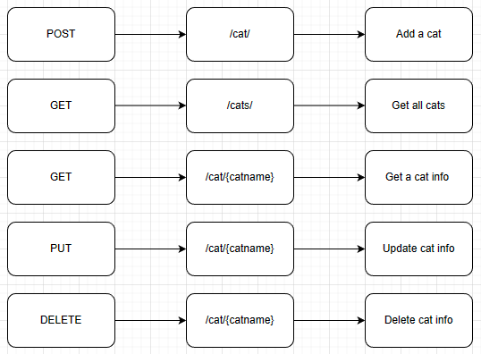

# GoCats
GoCats is a set of RESTful API written in **Golang** + **fiber** to store and update cats information into a **MongoDB** database. The GoCats contains basic C.R.U.D (Create, Read, Update, and Delete) operation. 
# To run the Golang program
Download the github repo:
https://github.com/RuichenHe/GoCats.git

Inside the GoCats folder, run:
`go mod tidy`

Inside the GoCats folder, run:
`go run main.go`

# Software Description
Based on the flow chart, there are five operations (cover all C.R.U.D) provided in the software, including **adding a cat**, **get all cats infomation**, **get a cat infomation by cat name**, **update a cat infomation by cat name**, and **delete a cat infomation by cat name**. 


A cat infomation contains following items:
`ID(string), Name(string), Brand(string), Age(int), Gender(string), Color(string), and Weight(string)`
## Add a cat
To add a cat, in postman, send a `POST` request with the cat infomation following the format:
```
{
    "name":"Oreo",
    "brand":"domestic short hair",
    "age":2,
    "gender": "female",
    "color": "black and white",
    "weight": "13kg"
}
```
to: `http://localhost:3000/cat`.
## Get all cats infomation
To access all cats infomation, send a `GET` request to: `http://localhost:3000/cats`.
## Get a cat infomation by cat name
To access one cat infomation by its name, send a `GET` request to: `http://localhost:3000/cat/YourCatName`.
## Update a cat infomation by cat name
To update one cat infomation by its name, send a `PUT` request with the new cat infomatoin following the format:
```
{
    "name": "Oreo",
    "brand": "domestic short hair",
    "age": 3,
    "gender": "female",
    "color": "black and white",
    "weight": "13kg"
}
```
to: `http://localhost:3000/cat/YourCatName`.
**Note:** The update infomation you send doesn't have to contain all items. Only the items need to be updated are necessary to include. 
## Delete a cat infomation by cat name
To delete a cat infomation by its name, send a `DELETE` request to: `http://localhost:3000/cat/YourCatName`. If the operation succeeds, a message will be returned: `"YourCatName record deleted"`. 
